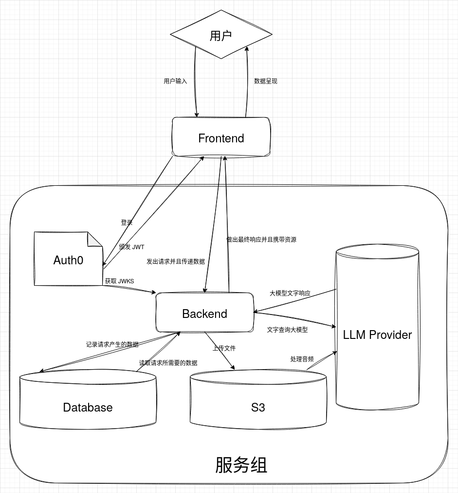

# 架构设计

整个程序使用 RESTful 风格来进行设计，争取后端不持有状态，使得程序天生具有分布式与负载均衡等水平拓展的能力，并且同样的在垂直拓展方向上仍然有着不俗的利用效率

为了达到如下目标，我们得到了如下架构与设计（排名不分先后）

- [工具](./TOOL.md)
- [数据库设计](./DATABASE.md)
- [端点设计与调用流程](./ENDPOINTS.md)
- [认证](./AUTH.md)
- [前端部分](./FRONTEND.md)

## 使用到的服务

我们使用了如下服务

- Auth0
  - 使用其作为 IAM，以此来更简单的接入 GitHub 和其他平台的登录
- S3
  - 使用其作为文件储存服务
  - 充分利用其作为远端储存并且高带宽的优势
  - 也作为上传文件的中转站，我们使用其作为 ASR 的中转和 TTS 的结果储存
- PostgreSQL
  - 我们利用其强大的类型能力构建了稳健的代码
  - 利用其强大的单机性能，在我们预期设想的用户量之下表现完全足够
  - 在未来，我们希望还能利用其强大的 pgvector 拓展来为用户实现强大的记忆功能

## 示意图

